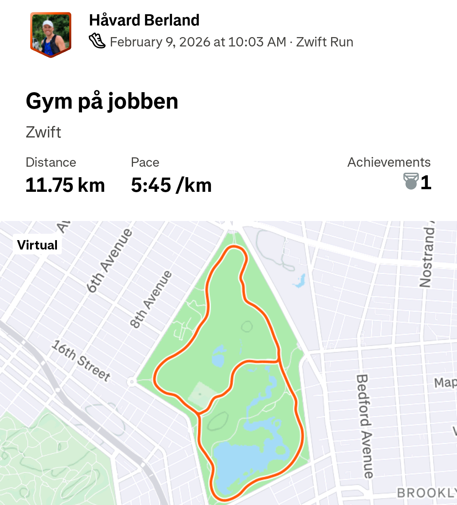

## Me

::: columns

::: {.column width=50%}

- Marathon runner (42 km - 2:34:30)
- 2-3 running workouts a day, 141 km/week in 2025
- Developer, both at work and at home

:::
::: {.column width=50%}


:::
:::

## My "Strava problem"

:::{.incremental}
- 2-3 workouts a day. Stick to "Morning Run", "Afternoon Run", etc?
- Automate fiddling in the Strava app for every workout
- Analyze runs and make the interesting statistics that Strava does not provide
:::

## Data flow


## Example

- Strava calls a webhook in my Python FastAPI application, activity data
  supplied as a `dict`:
  ```python
      if activity["device_name"] == "Zwift Run":
          start_time = datetime.fromisoformat(activity["start_date_local"])
          if start_time.weekday() == MONDAY and 8 < start_time.hour < 11: 
              update_activity(activity_id, {
                      "name": "Gym på jobben",
                      "description": "Zwift"})
  ```
{.fragment fragment-index=1 width=500 fig-align=center}

## Commute run features 

:::{layout-ncol="2"}

:::{#first-col}

::: {.fragment fragment-index=1}
- Detection and muting
:::
::: {.fragment fragment-index=2}
- Phone notification to select shoes, and copies to return commute
:::

{.fragment fragment-index=2 width=400 fig-align=center}
:::

:::{#second-col}

{.fragment fragment-index=1}


:::

:::

## Analysis of interval sessions

:::{layout-ncol="2"}

:::{#first-col}

- 5 years of rigid running protocol Tuesday, Thursday and Saturday 
{.fragment fragment-index=4 width=400}
:::

:::{#second-col}

{.fragment fragment-index=3}


:::

:::


## Data analysis
  
- Crossplot heart rate vs speed
[{width=1100}](https://grafana.raaserv.no/d/8MfvejXNz/intervallanalyse)

## Data analysis

- Interval speed for Tuesday 1000m over time
[](https://grafana.raaserv.no/d/8MfvejXNz/intervallanalyse)


## Thanks

- <https://github.com/berland/strava>

  ```bash
  $ wc -l *.py
  528 exercise_analyzer.py
  112 proxyserver.py
  271 stravaapp.py
  911 total
  ``` 
