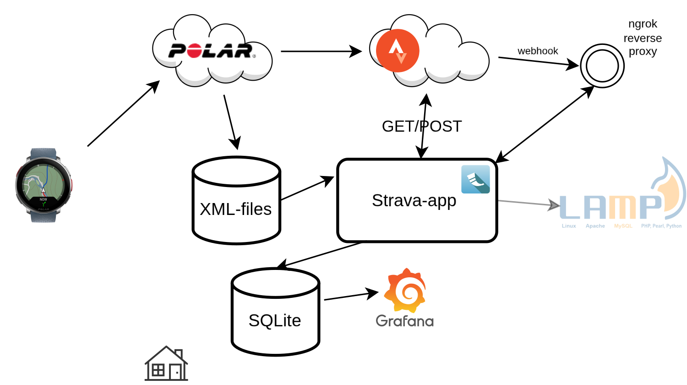
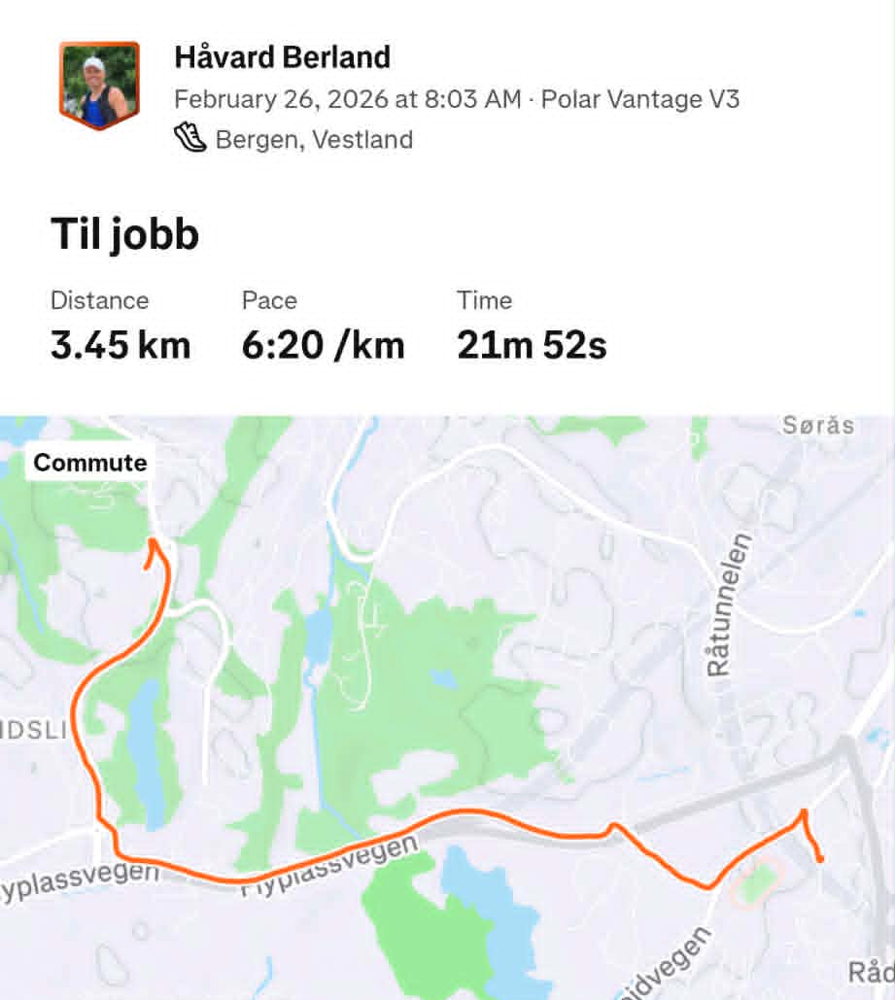
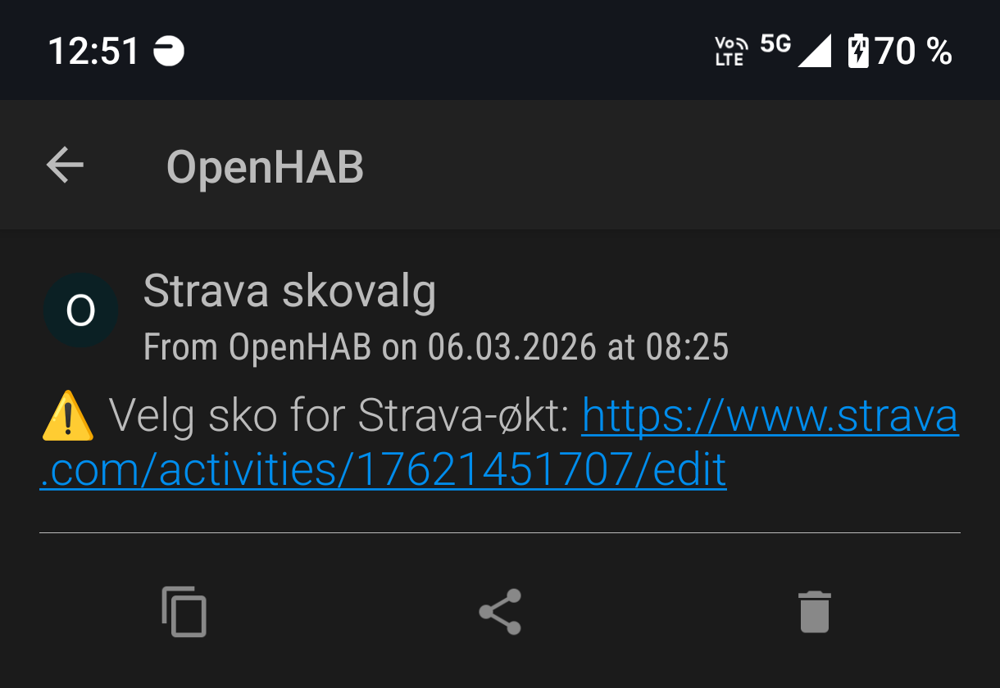
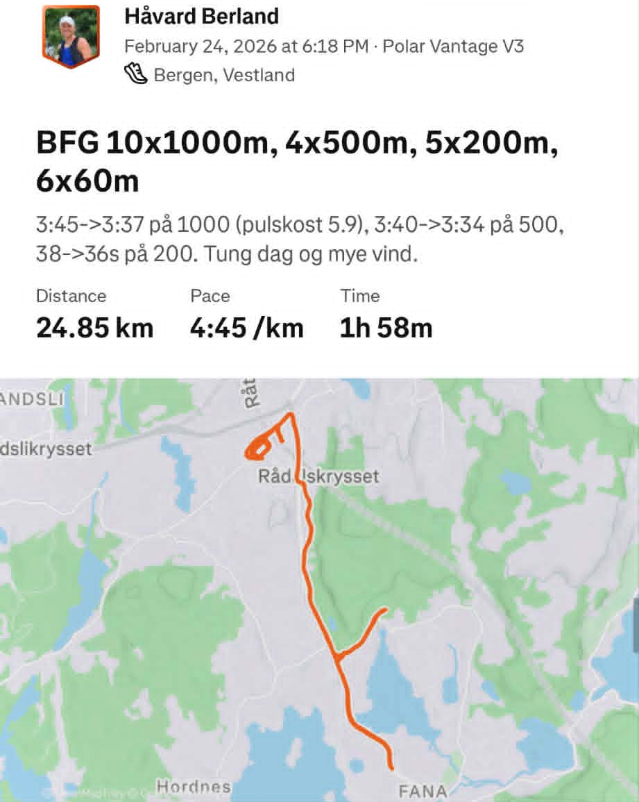

## Me

::: columns

::: {.column width=50%}

- Marathon runner (2:33:xx in Barcelona this Sunday)
- Developer, both at work and at home
- 2-3 running workouts a day

:::
::: {.column width=50%}

:::
:::

## Problem at hand
:::{.incremental}
- 2-3 workouts a day. Stick to "Morning Run", "Afternoon Run", etc?
- Automate fiddling in the Strava app for every workout
- Analyze runs, make statistics
:::

## Data flow

## Features

:::{layout-ncol="2"}

:::{#first-col}

::: {.fragment fragment-index=1}
- Detects my commutes, mutes them and sends me a notification to select shoe pair
:::
::: {.fragment fragment-index=2}
- Auto-sets shoe-pair for my return commute
:::
::: {.fragment fragment-index=3}
- Analyzes interval sessions. Rigid running protocol for every Tuesday, Thursday and Saturday 
:::
:::

:::{#second-col}
::::{.r-stack}
{.fragment .fade-in-then-out fragment-index=1 width=400}
{.fragment .fade-in-then-out fragment-index=1 width=400}
{.fragment .fade-in-then-out fragment-index=3 width=400}

::::
:::

:::

## Technical

:::{.incremental}

- Strava calls my home server through ngrok reverse proxy, activity supplied as
  a `dict` to a Python function in my FastAPI application
- Looks up XML file from Polar on local disk, and performs analysis of the workout
- Updates tokens regularly, and performs initial token handshake (OAuth2)
- https://github.com/berland/strava

:::

## Data analysis

- Interval speed for Tuesday 1000m over time
- Crossplot heart rate vs speed

